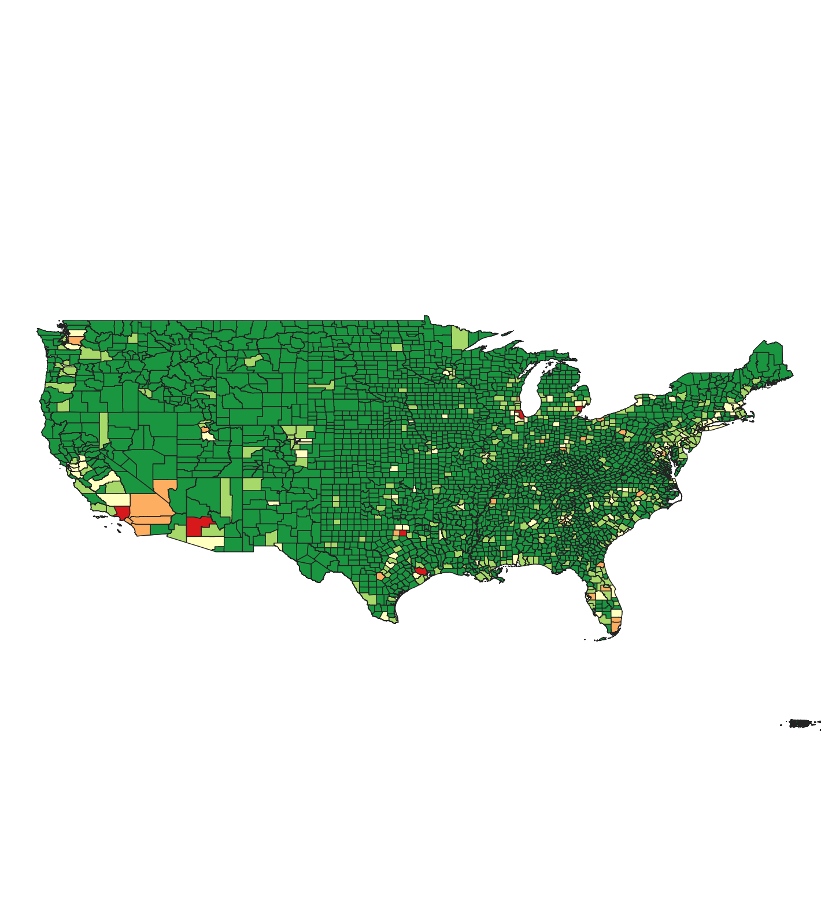
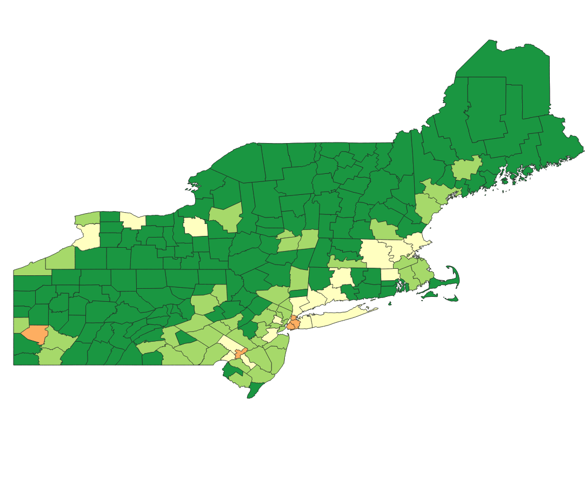
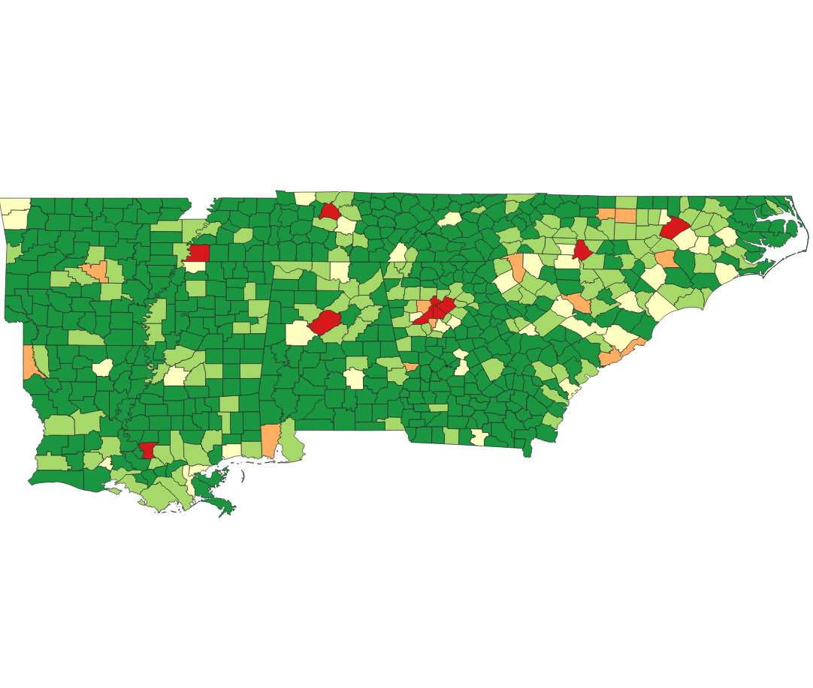
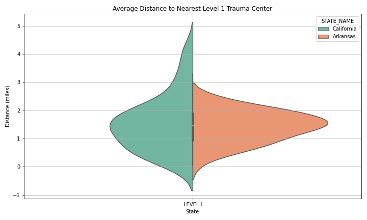
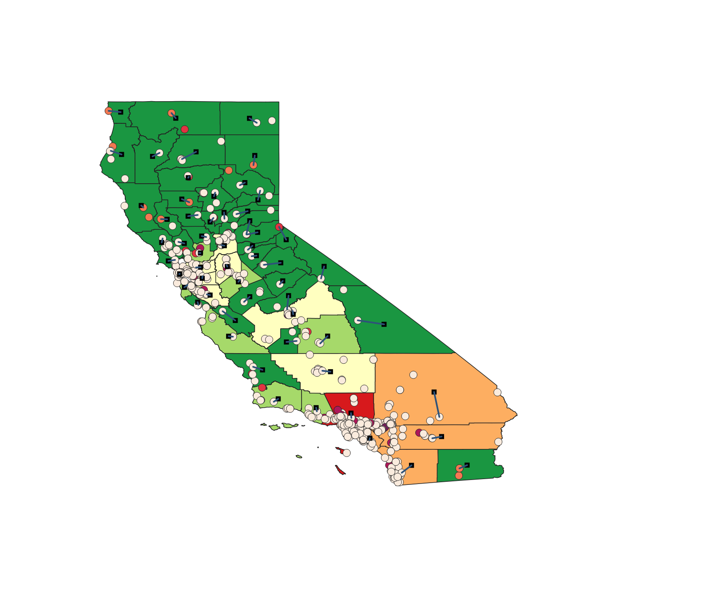
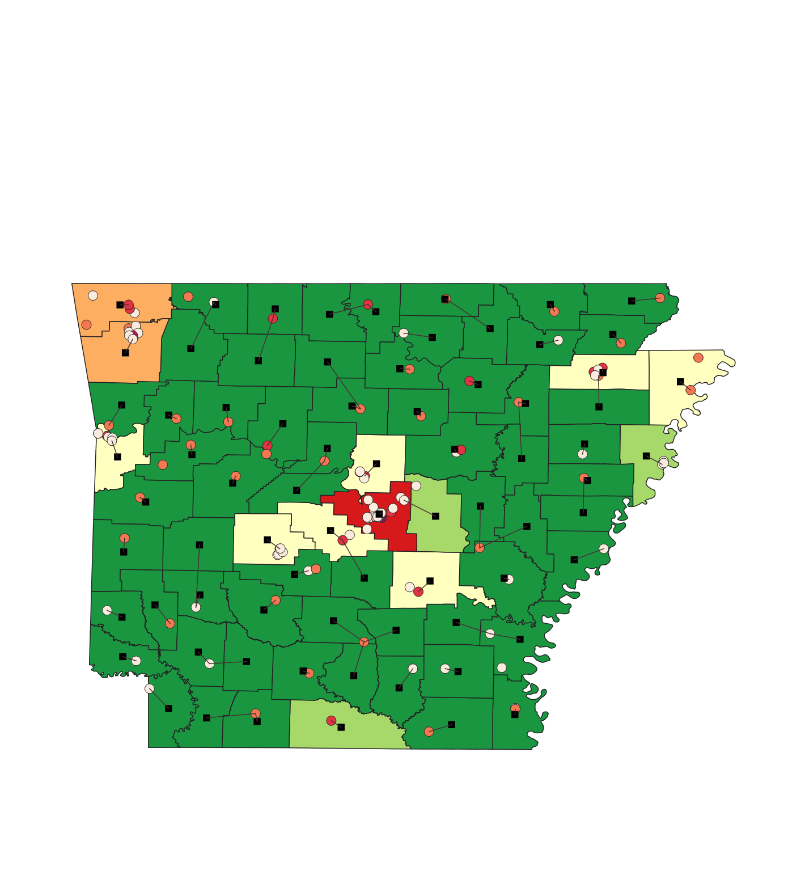
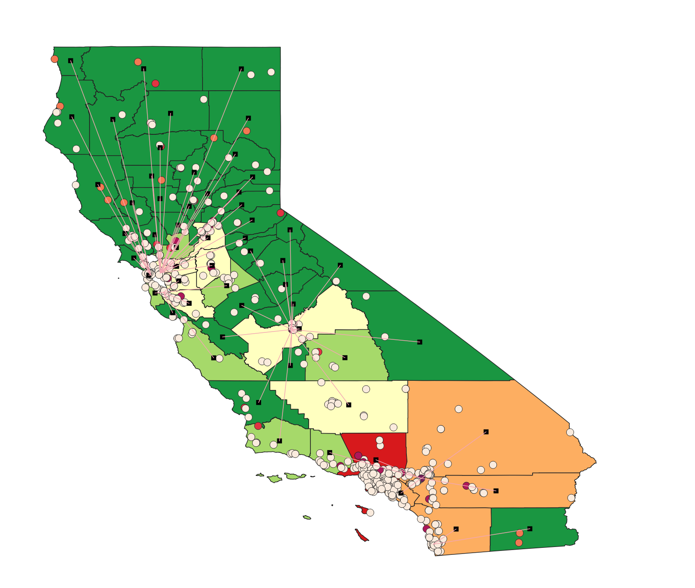
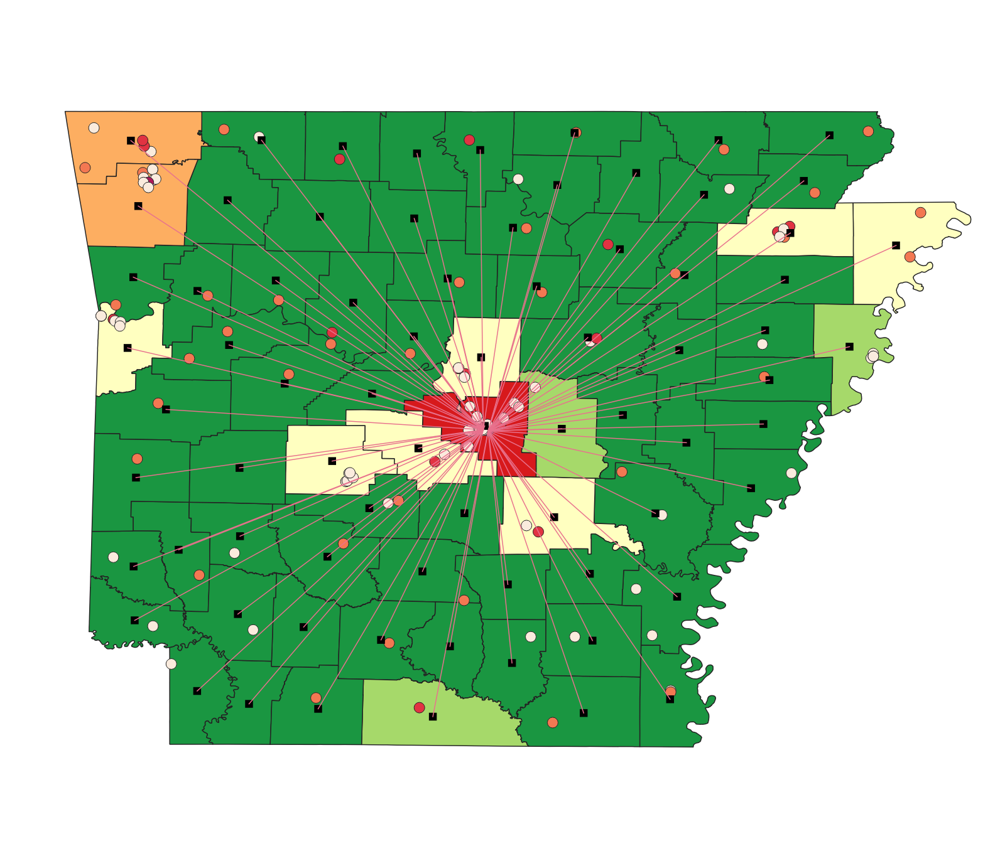
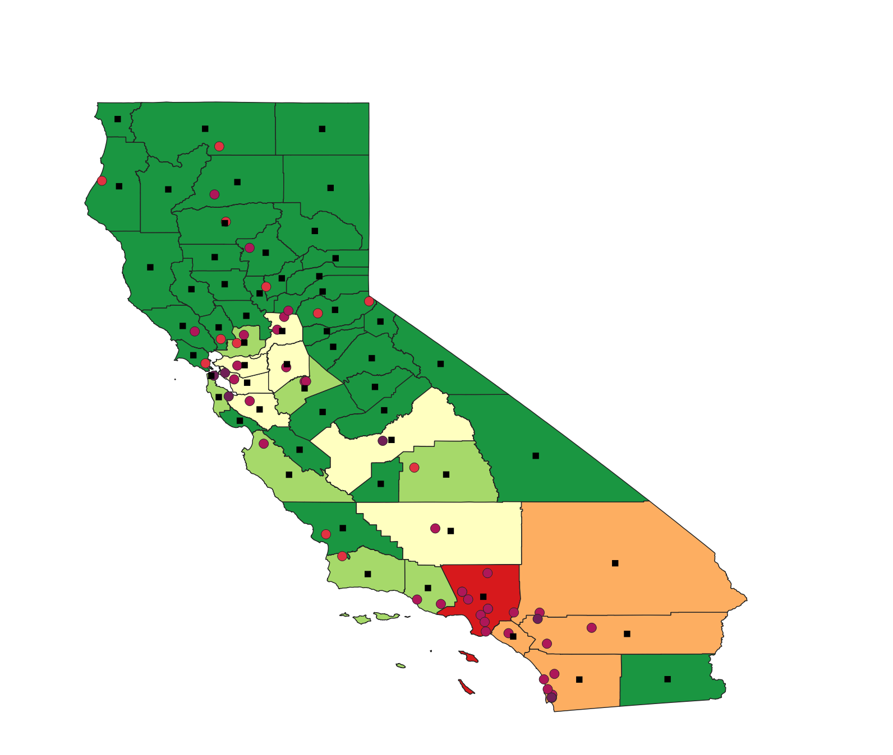
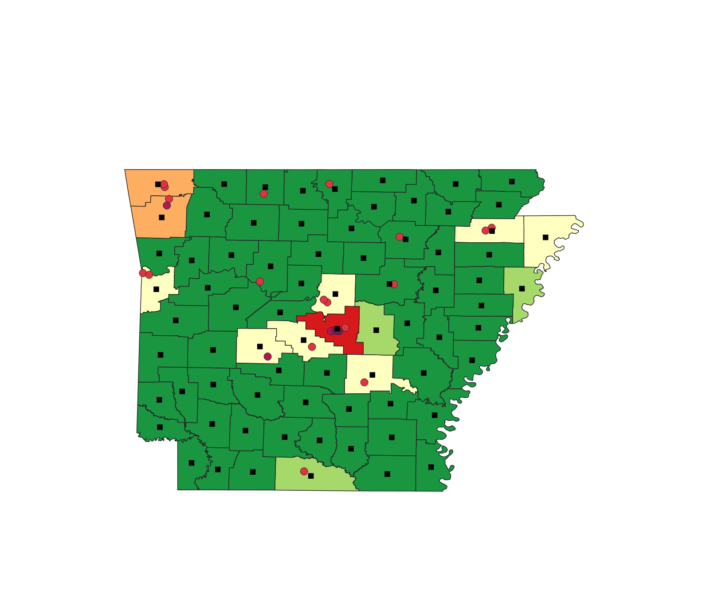

# Introduction: 

Maternal mortality is a persistent health concern in the United States, particularly in areas with fewer hospitals. Distance to medical facilties plays a role in the prevalence of maternal deaths; therefore, I analyzed the potential relationship between distance to the nearest hospital and mortality rates. To inform my analysis, I mapped the nearest distance from county centroids to a level 1 trauma center, which is the most comprehensive unit of care. To complete this analysis, I obtained three main data sources and computed several visualizations in both Python and QGIS. 

I began by mapping mortality rates for the entire country, then the northeast versus the south, and then I finally focused on California versus Arkansas, which had the lowest and highest rates of maternal mortality in 2021, respectively. 

# Repository Information: 

My input data included three main sources:

   ## 1. Mortality data 
   I obtained 'mortality.txt' from the Center for Disease Control and Prevention (CDC) WONDER database. When I requested this data, I grouped the results by county and then selected both 'Pregnancy, childbirth, and the puerperium" and "Certain conditions originating from the perinatal period" as the cause of death in the year 2021 (this is the most recent available year). From this text file, I utilized two columns containing each county fips code and the coinciding number of pregnancy-related deaths.
   ## 2. Hospital data 
   The Department of Homeland Security (DHS) has a database called the Homeland Infrastructure Foundation-Level Data, which contains a dataset with every hospital in the United States as of 2021. 'hospitals.zip' contains a plethora of columns including county fips code, latitude, longitude, trauma level, number of beds, and more. I used the geographic information along with the trauma level to support my analysis. 
   ## 3. County data 
   'cb_2021_us_county_500k.shp' is a Census cartographic boundary shapefile containing each county in the United States. I used this file to inform my visualizations in QGIS. 

My output data includes the other csv files that I created within my scripts. 

# Scripts:

I created seven scripts include a variety of cleaning, merges, computations, and visualizations.

    cleaning.py - Here, I began by cleaning the hospital and county files by renaming columns to match one another. Then, I saved the hospital data to a csv, which I continued to use throughout the entirety of this analysis. I also saved counties as a geopackage, followed by a merge of counties and hospitals into a csv. 

    hospitals.py - This script separates hospitals by trauma level. I will include a chart in this file that explains the differences between each unit. Essentially, level 1 trauma centers are the most equipped to provide life-saving serivces; however, they are the least common. That said, I grouped each hospital according to its level 1-5 trauma center together which produced a point file and geopackage to take into QGIS. 

    mortality.py - The mortality text file needed a fair amount of cleaning, which is the entirety of this script. Each column was strung together by quotes in the original file and the columns were not named efficiently. Then, I merged the mortality data onto the county data and saved as a geopackage.

    join.py - In created a separate script to perform a slightly different join than on the previous script. I am still joining mortality onto counties, but on 'GEOID' and 'COUNTYFP' instead to create another geopackage. 

    trauma.py - This is where I renamed columns and placed them into categories based on trauma levels 1-5. To create a point file that i could color code in QGIS, I gave each trauma level a 'score' of 1-6 according to capabilities. Then, I imported the shortest line measures from QGIS from county centroids to the nearest hospital. 

    distance.py - In this script, I created a violin plot to compare distances to the nearest level 1 trauma center in Arkansas versus California.

    nearest.py - Finally, my last script performs a spatial join to compute the nearest distance from county centroids to any hospital. This serves as a more efficient way to calculate nearest distances, opposed to the calculation shown on the previous scripts. 

# Visualizations: 

This is the first visualization I made, which is a heatmap showing maternal deaths throughout the entire United States. For reference, the darkest red is where the most deaths occur. The rest show similar heatmaps of different areas including points showing hospital locations. As an aside, I created a few more visualizations that did not end up as a main part of my analysis, but I included in the repository for reference. 

Northeast mortality heatmap:

South mortality heatmap:

Split violin plot showing nearest Level 1 trauma center for California and Arkansas:

California distance from county centroid to nearest hospital:

Arkansas distance from county centroid to nearest hospital: 

California distance to nearest Level 1 trauma center:

Arkansas distance to nearest Level 1, trauma center: 

California distance to nearest Level 1, 2, or 3 trauma center - Level 1 is the darkest purple and Level 3 is the lightest:

Arkansas distance to nearest Level 1, 2, or 3 trauma center - Level 1 is the darkest purple and Level 3 is the lightest: 

# Main findings: 

Since death records are treated with a great sense of privacy, maintaining accuracy throughout this type of analysis was challenging. For example, the location of death often occurs at or is recorded at the hospital address, which poses difficulty for measuring distance from one's home address to the nearest hospital or level 1 trauma center. Since home addresses were not available to me, I used county centroids as my reference point when calculating nearest distances.

Overall, I have confirmed what I suspected, which is that Level 1, 2, and 3 trauma centers are largely inaccessible to those in rural areas. While I cannot report the exact impact on maternal deaths without home addresses, I can infer from this analysis that distance to the nearest hospital does play a role in one's ability to receive emergent care. 

Regarding my comparison between California and Arkansas, geographic data alone does not provide sufficient information to confirm nor deny the exact relationship between distance to the nearest hospital or Level 1 trauma center and maternal deaths; however, these maps do offer insight that could be coupled with other data, such as socioeconomic factors, to provide a more comprehensive exploration. 

# Potential for future research: 

Regarding a future analysis, I am interested to shift from a geography-centric analysis to an analysis based on the cause of death. While I could certainly still complete a geographic analysis by mapping various birth-related causes of death, understanding the differences in death rates for each cause of death can lend itself to which trauma level is the most useful for maternal causes. 
